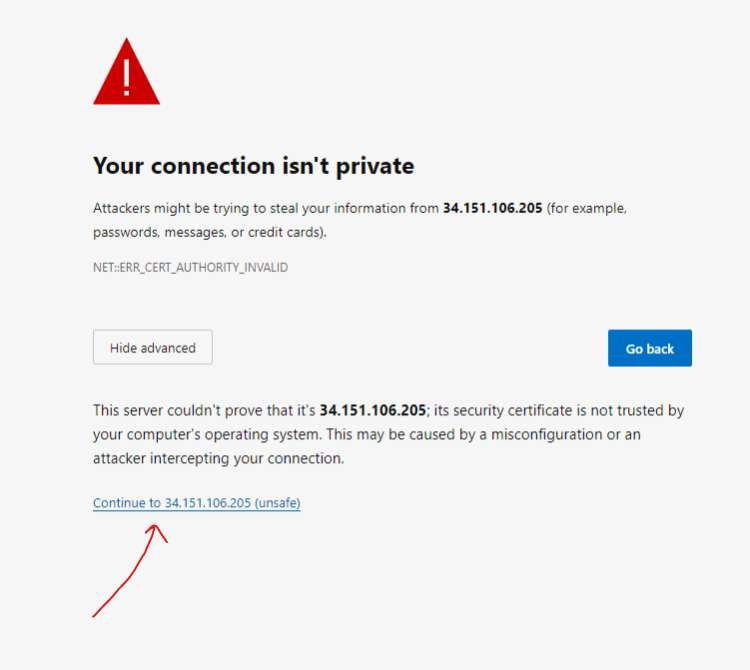
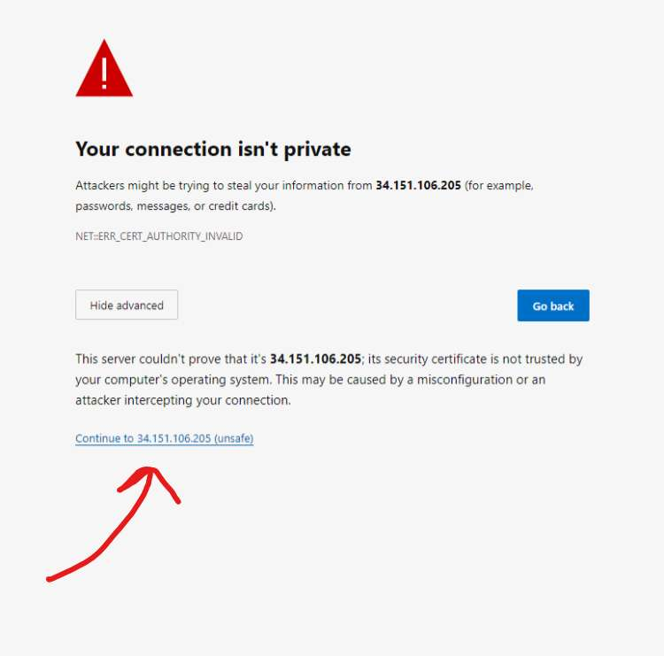
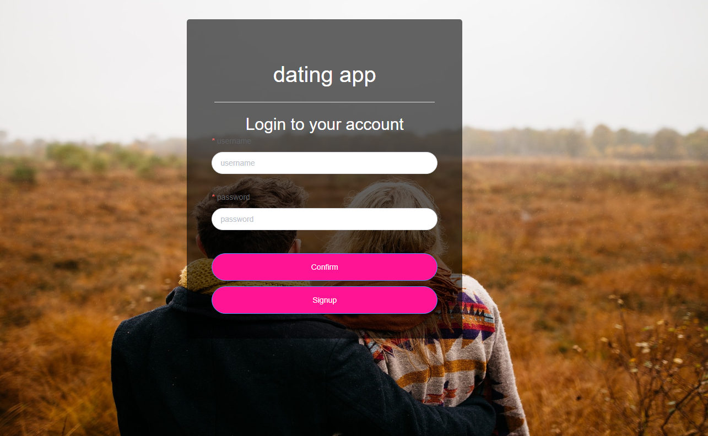

# SSE-dating-app-backend

## Use the deployed application (recommended)
1. This app has been deploy on the google cloud, so you can use it on the browser (Chrome is recommended)
2. Because this application uses self-signed HTTPS SSL certificate, so you need to manually trust this domain at first. 
    1. Use the browser to request `https://34.151.106.205:7001/login/RSA`, just like this:
    
    2. After that, you can use `https://34.151.106.205:8080/login` to start using the app, you might need to trust the domain again by doing like this: 
    
3. Then you will see the login page, you can register a new account or use the test account:

```
Username: Admin1234
Password: a123456
Verification Code: 123456
```

## QuickStart locally
1. Please make sure your MySQL is running and the version should be 8.0.22.
2. Create a database named `SSE-dating-app` by running: 

    ```
    CREATE DATABASE `SSE-dating-app` /*!40100 DEFAULT CHARACTER SET utf8mb4 COLLATE utf8mb4_0900_ai_ci */ /*!80016 DEFAULT ENCRYPTION='N' */;
    ```
3. In this new database, running the SQL script in `./SSE-dating-app.sql`
4. Change the SQL configuration inside `./config/config.default.js`, locate to the following object and change your MySQL port, username, and password: 
    ```
    config.mysql = {
        client: {
        host: '127.0.0.1',
        port: '3306',
        user: 'root',
        password: '123456',
        database: 'SSE-dating-app',
        },
    };
    ```
5. Please make sure your node.js version is v.14.20.1
6. Install cnpm globally by running `npm install -g cnpm`
7. Run `cnpm i`   
6. Make sure port:7001 is not in used
6. Run `npm run dev` to start the server, the backend will be running in http://localhost:7001
    - If module `nodemailer` does not exist, please run `cnpm i nodemailer` 
7. Because this application uses self-signed HTTPS SSL certificate, so you need to manually trust this domain by first request: `https://localhost:7001/login/RSA` on the browser.
8. After trust the domain, you can request `https://localhost:8080/login` to start using the dating application
