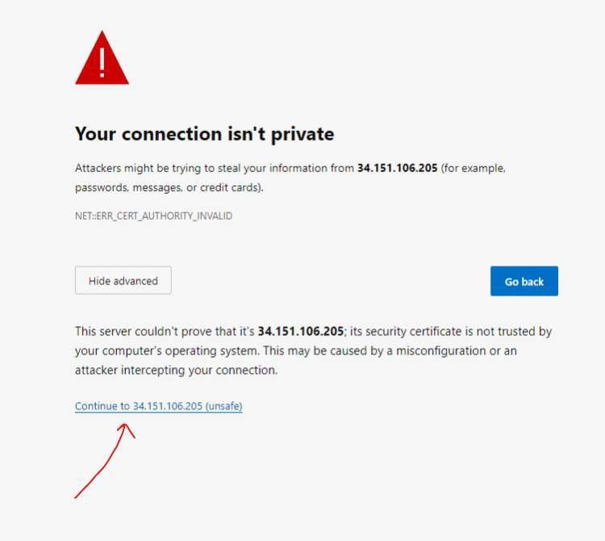
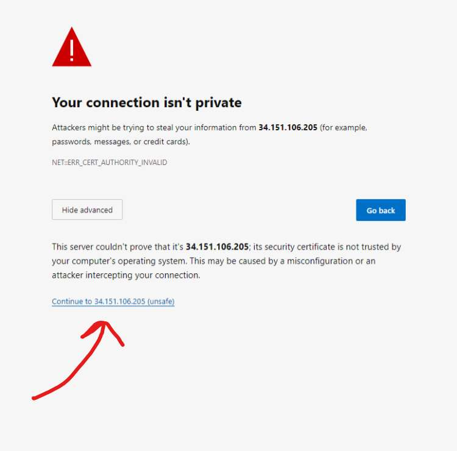
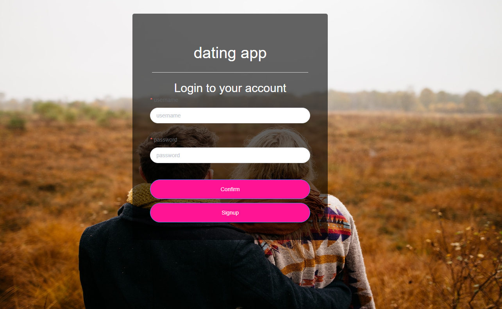
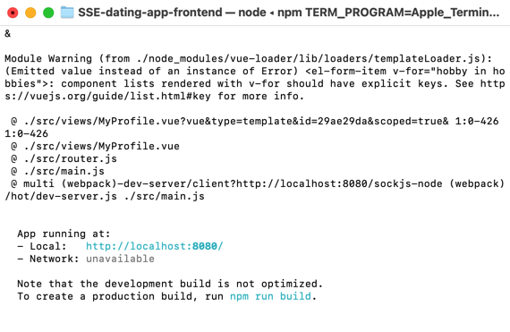

# SSE-dating-app-frontend

## Use the deployed application (recommended)
1. This app has been deploy on the google cloud, so you can use it on the browser (Chrome is recommended)
2. Because this application uses self-signed HTTPS SSL certificate, so you need to manually trust this domain at first. 
    1. Use the browser to request `https://34.151.106.205:7001/login/RSA`, just like this:
    
    2. After that, you can use `https://34.151.106.205:8080` to start using the app, you might need to trust the domain again by doing like this: 
    
3. Then you will see the login page, you can register a new account or use the test account:

```
Username: Admin1234
Password: a123456
Verification Code: 123456
```

## Quick start locally
1. Please start the backend server before starting the frontend program
2. Please use Node v.14.20.1
3. Install cnpm by runing `npm install -g cnpm`
4. Run `cnpm i` to install dependency
5. Run `npm run serve` to start the frontend (The first time of running takes around 5 minutes to compile)
    - You may encounter the error of missing the following dependency:
        ```
        cos-js-sdk
        ```
    - You can run `cnpm install cos-js-sdk-v5@14.6` to solve this problem


6. After compiling successfully, you will see the follow information: 
    
7. Then use chrome to run the frontend application using the URL: `https://localhost:8080`

## Application guide
1. In the login page, you can register a new account, or use the test account:

```
Username: Admin1234
Password: a123456
Verification Code: 123456
```

